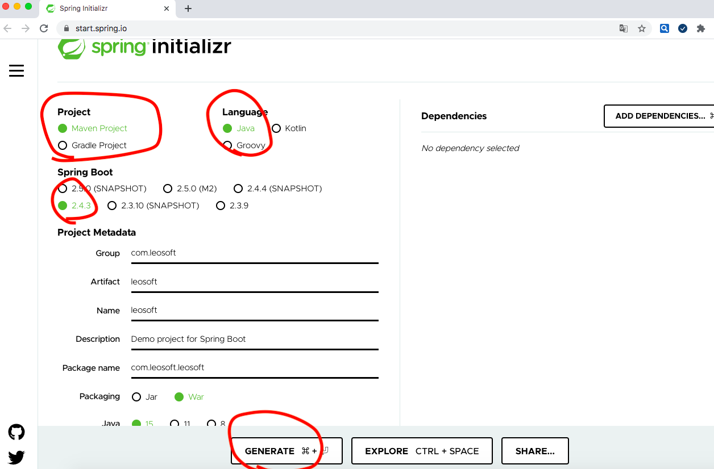

# Create Project

https://start.spring.io/

生成した leosoft.zip をダウンロードして、ワークスペースに解凍する。

`unzip leosoft.zip`

# ソース修正

改修内容、下記のURLで確認してください。

https://spring.io/quickstart

# RUN

`cd java/spring/cathy/leosoft`

`$ ./mvnw spring-boot:run`

# ACCESS

`$ curl http://localhost:8080/hello`

Hello World!

`$ curl http://localhost:8080/hello?name=Cathy`

Hello Cathy!

# エラー対応

## Web server failed to start. Port 8080 was already in use.

ポートを開いてるプロセスをkillする方法

`$ lsof -i -P | grep 8080`
java      99189 jinghuizhen   36u  IPv6 0x830dcbcf090ac895      0t0  TCP *:8080 (LISTEN)

パラメータの「-9」を忘れないように

`$ kill -9 99189`

再度プロジェクトを起動する。

`$ ./mvnw spring-boot:run`

# Git

## ワークスペース

/Users/jinghuizhen/tech-blog

## コマンド

`$ git add - A`

`$ git commit -m "[java][spring][cathy]hello sample"`

`$ git push`
