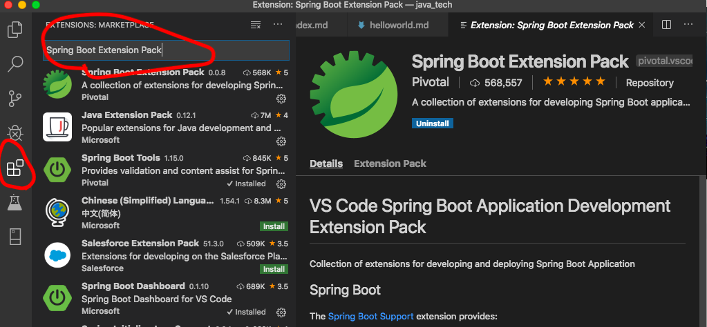
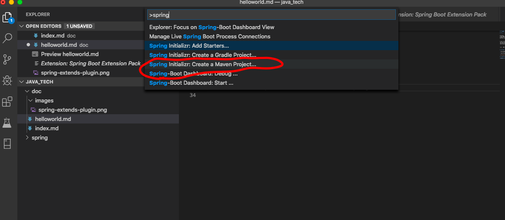
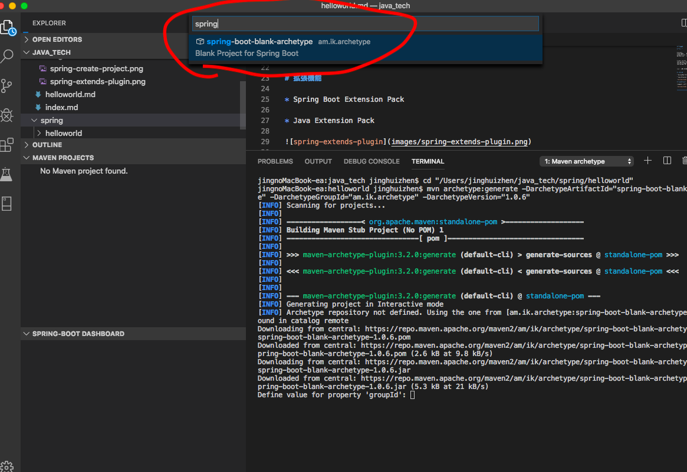
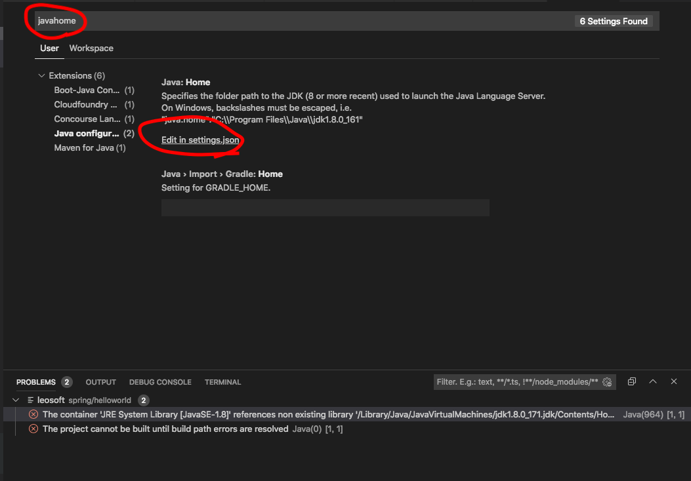

# 環境確認

```
$ sw_vers
ProductName:	Mac OS X
ProductVersion:	10.13.6
BuildVersion:	17G14019
```

```
$ java -version
java version "1.8.0_171"
Java(TM) SE Runtime Environment (build 1.8.0_171-b11)
Java HotSpot(TM) 64-Bit Server VM (build 25.171-b11, mixed mode)
```

```
開発ツール：VSCODE
```

# 拡張機能

* Spring Boot Extension Pack

* Java Extension Pack



# CreateProject

[command + shift + p] 拡張機能のコマンドパレットで「spring」と検索し、





TERMINAL画面でプロジェクトのPropertiesを定義する。

```
Define value for property 'groupId': leosoft
Define value for property 'artifactId': leosoft
Define value for property 'version' 1.0-SNAPSHOT: : 1.0.0
Define value for property 'package' leosoft: : leosoft
Confirm properties configuration:
groupId: leosoft
artifactId: leosoft
version: 1.0.0
package: leosoft
 Y: : y
 ```

# コンパイル

`$ mvn clean install`

# 実行

`$ mvn spring-boot:run`


# Java バージョンアップ

## OPEN　JDK15 入手

https://jdk.java.net/15/

macOS/x64 用

`openjdk-15.0.2_osx-x64_bin.tar.gz`

をダウンロードする。

## 現在のJava情報を確認する

`$ /usr/libexec/java_home -V`

 ```
Matching Java Virtual Machines (1):
    1.8.0_171, x86_64:	"Java SE 8"	/Library/Java/JavaVirtualMachines/jdk1.8.0_171.jdk/Contents/Home
 ```

## 操作手順

`cd ~/Downloads`

`$ mv openjdk-15.0.2_osx-x64_bin.tar.gz /Users/jinghuizhen/java15`

`cd /Users/jinghuizhen/java15`

`$ tar -xf openjdk-15.0.2_osx-x64_bin.tar.gz`


`$ ls -la`

 ```
total 393760
drwxr-xr-x@  4 jinghuizhen  staff        128  3  6 13:40 .
drwxr-xr-x+ 76 jinghuizhen  staff       2432  3  6 13:39 ..
drwxr-xr-x@  3 jinghuizhen  staff         96 12  8 07:35 jdk-15.0.2.jdk
-rw-r--r--@  1 jinghuizhen  staff  192067136  3  6 13:07 openjdk-15.0.2_osx-x64_bin.tar.gz
 ```

アンインストール既存のJava

`$ sudo rm -rf /Library/Java/JavaVirtualMachines/jdk1.8.0_171.jdk`

インストール　OpenJDK 15
`$ sudo mv jdk-15.0.2.jdk /Library/Java/JavaVirtualMachines/`

Javaのバージョンを確認する
`$ java -version`

 ```
openjdk version "15.0.2" 2021-01-19
OpenJDK Runtime Environment (build 15.0.2+7-27)
OpenJDK 64-Bit Server VM (build 15.0.2+7-27, mixed mode, sharing)
 ```

 GOOD　JOB！
 
## VS java.home 設定


`Command + , `(コンマ）キー のショートカットキーで[設定画面を開く。



settings.json で編集」を選択し、以下「java.home」へ貼り付け

```
{
    "editor.suggestSelection": "first",
    "vsintellicode.modify.editor.suggestSelection": "automaticallyOverrodeDefaultValue",
    "window.zoomLevel": 0,
    "java.home": "/Library/Java/JavaVirtualMachines/jdk-15.0.2.jdk/Contents/Home"
}
```

* * *
 # エラー対応
 ## Fatal error compiling: java.lang.ExceptionInInitializerError: com.sun.tools.javac.code.TypeTags 

### エラー情報

 `cd helloworld/leosoft`

 `$ mvn spring-boot:run`

 ```
 [ERROR] Failed to execute goal org.apache.maven.plugins:maven-compiler-plugin:3.1:compile (default-compile) on project leosoft: Fatal error compiling: java.lang.ExceptionInInitializerError: com.sun.tools.javac.code.TypeTags -> [Help 1]
[ERROR] 
[ERROR] To see the full stack trace of the errors, re-run Maven with the -e switch.
[ERROR] Re-run Maven using the -X switch to enable full debug logging.
[ERROR] 
[ERROR] For more information about the errors and possible solutions, please read the following articles:
[ERROR] [Help 1] http://cwiki.apache.org/confluence/display/MAVEN/MojoExecutionException
jingnoMacBook-ea:leosoft jinghuizhen$ mvn spring-boot:run

 ```

### 対応方法

 ```
    <properties>
        <project.build.sourceEncoding>UTF-8</project.build.sourceEncoding>
        <start-class>leosoft.App</start-class>
        <java.version>1.8</java.version>
        <!--
        <lombok.version>1.14.8</lombok.version>
        >
        <lombok.version>1.18.2</lombok.version>
        <log4jdbc.log4j2.version>1.16</log4jdbc.log4j2.version>
        <rest.assured.version>2.3.3</rest.assured.version>
    </properties>
 ```

 ## nested exception is java.lang.NoClassDefFoundError: javax/xml/bind/ValidationException

### エラー情報

 ```
 rg.springframework.beans.factory.BeanCreationException: Error creating bean with name 'org.springframework.boot.context.properties.ConfigurationPropertiesBindingPostProcessor': Invocation of init method failed; nested exception is java.lang.NoClassDefFoundError: javax/xml/bind/ValidationException
        at org.springframework.beans.factory.support.AbstractAutowireCapableBeanFactory.initializeBean(AbstractAutowireCapableBeanFactory.java:1572)
        at org.springframework.beans.factory.support.AbstractAutowireCapableBeanFactory.doCreateBean(AbstractAutowireCapableBeanFactory.java:539)
        at org.springframework.beans.factory.support.AbstractAutowireCapableBeanFactory.createBean(AbstractAutowireCapableBeanFactory.java:476)
 ```

 ### 原因

 ```
 The JAXB APIs are considered to be Java EE APIs and therefore are no longer contained on the default classpath in Java SE 9. In Java 11, they are completely removed from the JDK.

Java 9 introduces the concepts of modules, and by default, the java.se aggregate module is available on the classpath (or rather, module-path). As the name implies, the java.se aggregate module does not include the Java EE APIs that have been traditionally bundled with Java 6/7/8.

Fortunately, these Java EE APIs that were provided in JDK 6/7/8 are still in the JDK, but they just aren't on the classpath by default. 
 ```

### 対応方法


 ```

        <dependency>
            <groupId>javax.xml.bind</groupId>
            <artifactId>jaxb-api</artifactId>
            <version>2.3.1</version>
        </dependency>
 ```

## 実行エラ
### 実行コマンド

`$ mvn spring-boot:run`

### エラー情報

<details>
<summary>Javaバージョンにより発生したエラー</summary>
<div>

\```rb

 [INFO] Attaching agents: [/Users/jinghuizhen/.m2/repository/org/springframework/springloaded/1.2.4.RELEASE/springloaded-1.2.4.RELEASE.jar]
OpenJDK 64-Bit Server VM warning: Options -Xverify:none and -noverify were deprecated in JDK 13 and will likely be removed in a future release.
java.lang.RuntimeException: Reloading agent exited via exception, please raise a jira
        at org.springsource.loaded.agent.ClassPreProcessorAgentAdapter.transform(ClassPreProcessorAgentAdapter.java:110)
        at java.instrument/java.lang.instrument.ClassFileTransformer.transform(ClassFileTransformer.java:246)
        at java.instrument/sun.instrument.TransformerManager.transform(TransformerManager.java:188)
        at java.instrument/sun.instrument.InstrumentationImpl.transform(InstrumentationImpl.java:563)
        at java.base/java.lang.ClassLoader.defineClass1(Native Method)
        at java.base/java.lang.ClassLoader.defineClass(ClassLoader.java:1016)
        at java.base/java.security.SecureClassLoader.defineClass(SecureClassLoader.java:151)
        at java.base/jdk.internal.loader.BuiltinClassLoader.defineClass(BuiltinClassLoader.java:825)
        at java.base/jdk.internal.loader.BuiltinClassLoader.findClassOnClassPathOrNull(BuiltinClassLoader.java:723)
        at java.base/jdk.internal.loader.BuiltinClassLoader.loadClassOrNull(BuiltinClassLoader.java:646)
        at java.base/jdk.internal.loader.BuiltinClassLoader.loadClass(BuiltinClassLoader.java:604)
        at java.base/jdk.internal.loader.ClassLoaders$AppClassLoader.loadClass(ClassLoaders.java:168)
        at java.base/java.lang.ClassLoader.loadClass(ClassLoader.java:522)
        at java.base/java.lang.Class.forName0(Native Method)
        at java.base/java.lang.Class.forName(Class.java:468)
        at java.base/sun.launcher.LauncherHelper.loadMainClass(LauncherHelper.java:780)
        at java.base/sun.launcher.LauncherHelper.checkAndLoadMain(LauncherHelper.java:675)
Caused by: java.lang.IllegalArgumentException
        at sl.org.objectweb.asm.ClassReader.<init>(Unknown Source)
        at sl.org.objectweb.asm.ClassReader.<init>(Unknown Source)
        at org.springsource.loaded.TypeDescriptorExtractor.extract(TypeDescriptorExtractor.java:49)
        at org.springsource.loaded.TypeRegistry.getDescriptorFor(TypeRegistry.java:331)
        at org.springsource.loaded.TypeDescriptorExtractor$ExtractionVisitor.getTypeDescriptorFor(TypeDescriptorExtractor.java:139)
        at org.springsource.loaded.TypeDescriptorExtractor$ExtractionVisitor.findTypeDescriptor(TypeDescriptorExtractor.java:155)
        at org.springsource.loaded.TypeDescriptorExtractor$ExtractionVisitor.walkHierarchyForCatchersAndSuperDispatchers(TypeDescriptorExtractor.java:168)
        at org.springsource.loaded.TypeDescriptorExtractor$ExtractionVisitor.computeCatchersAndSuperdispatchers(TypeDescriptorExtractor.java:237)
        at org.springsource.loaded.TypeDescriptorExtractor$ExtractionVisitor.getTypeDescriptor(TypeDescriptorExtractor.java:94)
        at org.springsource.loaded.TypeDescriptorExtractor.extract(TypeDescriptorExtractor.java:52)
        at org.springsource.loaded.TypeRegistry.addType(TypeRegistry.java:1089)
        at org.springsource.loaded.agent.SpringLoadedPreProcessor.preProcess(SpringLoadedPreProcessor.java:335)
        at org.springsource.loaded.agent.ClassPreProcessorAgentAdapter.transform(ClassPreProcessorAgentAdapter.java:107)
        ... 16 more
java.lang.IllegalArgumentException
        at sl.org.objectweb.asm.ClassReader.<init>(Unknown Source)
        at sl.org.objectweb.asm.ClassReader.<init>(Unknown Source)
        at org.springsource.loaded.SystemClassReflectionRewriter.rewrite(SystemClassReflectionRewriter.java:84)
        at org.springsource.loaded.agent.SpringLoadedPreProcessor.preProcess(SpringLoadedPreProcessor.java:148)
        at org.springsource.loaded.agent.ClassPreProcessorAgentAdapter.transform(ClassPreProcessorAgentAdapter.java:107)
        at java.instrument/java.lang.instrument.ClassFileTransformer.transform(ClassFileTransformer.java:246)
        at java.instrument/sun.instrument.TransformerManager.transform(TransformerManager.java:188)
        at java.instrument/sun.instrument.InstrumentationImpl.transform(InstrumentationImpl.java:563)
        at java.base/sun.reflect.annotation.AnnotationParser$1.run(AnnotationParser.java:306)
        at java.base/sun.reflect.annotation.AnnotationParser$1.run(AnnotationParser.java:304)
        at java.base/java.security.AccessController.doPrivileged(AccessController.java:312)
        at java.base/sun.reflect.annotation.AnnotationParser.annotationForMap(AnnotationParser.java:304)
        at java.base/sun.reflect.annotation.AnnotationParser.parseAnnotation2(AnnotationParser.java:294)
        at java.base/sun.reflect.annotation.AnnotationParser.parseAnnotations2(AnnotationParser.java:121)
        at java.base/sun.reflect.annotation.AnnotationParser.parseSelectAnnotations(AnnotationParser.java:102)
        at java.base/sun.reflect.annotation.AnnotationType.<init>(AnnotationType.java:145)
        at java.base/sun.reflect.annotation.AnnotationType.getInstance(AnnotationType.java:85)
        at java.base/sun.reflect.annotation.AnnotationParser.parseAnnotation2(AnnotationParser.java:267)
        at java.base/sun.reflect.annotation.AnnotationParser.parseAnnotations2(AnnotationParser.java:121)
        at java.base/sun.reflect.annotation.AnnotationParser.parseAnnotations(AnnotationParser.java:73)
        at java.base/java.lang.reflect.Executable.declaredAnnotations(Executable.java:620)
        at java.base/java.lang.reflect.Executable.declaredAnnotations(Executable.java:618)
        at java.base/java.lang.reflect.Executable.getAnnotation(Executable.java:586)
        at java.base/java.lang.reflect.Method.getAnnotation(Method.java:694)
        at java.base/java.lang.reflect.AnnotatedElement.isAnnotationPresent(AnnotatedElement.java:292)
        at java.base/java.lang.reflect.AccessibleObject.isAnnotationPresent(AccessibleObject.java:545)
        at java.base/jdk.internal.reflect.Reflection.isCallerSensitive(Reflection.java:335)
        at java.base/jdk.internal.reflect.ReflectionFactory.newMethodAccessor(ReflectionFactory.java:192)
        at java.base/java.lang.reflect.Method.acquireMethodAccessor(Method.java:630)
        at java.base/java.lang.reflect.Method.invoke(Method.java:562)
        at org.springsource.loaded.ri.ReflectiveInterceptor.jlrMethodInvoke(ReflectiveInterceptor.java:1426)
        at ch.qos.logback.classic.util.EnvUtil.loadFromServiceLoader(EnvUtil.java:81)
        at ch.qos.logback.classic.util.ContextInitializer.autoConfig(ContextInitializer.java:154)
        at org.slf4j.impl.StaticLoggerBinder.init(StaticLoggerBinder.java:85)
        at org.slf4j.impl.StaticLoggerBinder.<clinit>(StaticLoggerBinder.java:55)
        at org.slf4j.LoggerFactory.bind(LoggerFactory.java:141)
        at org.slf4j.LoggerFactory.performInitialization(LoggerFactory.java:120)
        at org.slf4j.LoggerFactory.getILoggerFactory(LoggerFactory.java:331)
        at org.slf4j.LoggerFactory.getLogger(LoggerFactory.java:283)
        at org.apache.commons.logging.impl.SLF4JLogFactory.getInstance(SLF4JLogFactory.java:155)
        at org.apache.commons.logging.impl.SLF4JLogFactory.getInstance(SLF4JLogFactory.java:132)
        at org.apache.commons.logging.LogFactory.getLog(LogFactory.java:273)
        at org.springframework.boot.SpringApplication.<init>(SpringApplication.java:162)
        at org.springframework.boot.SpringApplication.run(SpringApplication.java:969)
        at org.springframework.boot.SpringApplication.run(SpringApplication.java:958)
        at leosoft.App.main(App.java:9)
3月 06, 2021 1:03:28 午後 org.springsource.loaded.agent.SpringLoadedPreProcessor preProcess

\```

</div>
</details>

 
### 対応方法

Javaバージョンを「JDK15」にアップする。

